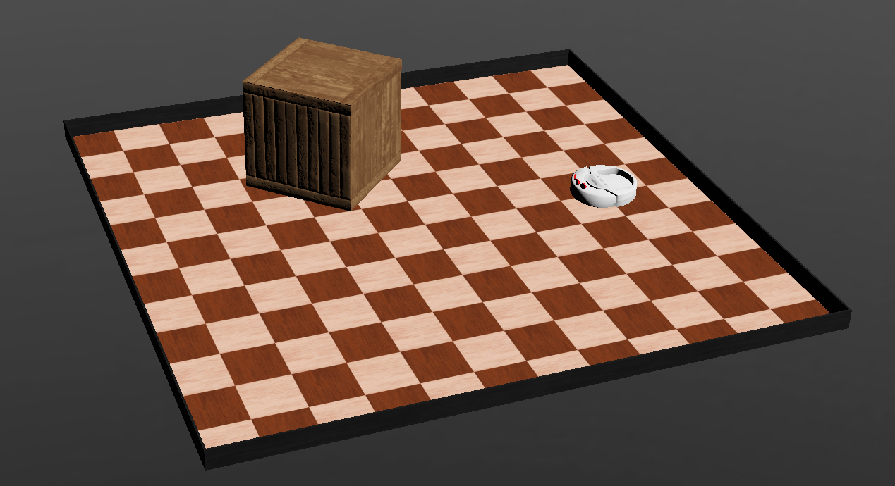

# VacuSim - Roboterprogrammierungstraining und Wettbewerb in einem simulierten Staubsaugerszenario


---

English Readme: [](README.md)

---

Dieses Projekt beinhaltet einen Treiber für einen Roboterstaubsauger sowie ein Benchmarking-Tool, welches es ermöglicht, erste Erfahrungen in der Programmierung von Robotern mit ROS 2 Humble zu sammeln.
Das Szenario ist eine Wohnung, die gereinigt werden soll.
Der Treiber bietet Schnittstellen zu den Aktuatoren und Sensoren des Roboters.
Das Benchmarking-Tool bewertet den Reinigungsprozess.
Der Schwerpunkt liegt darauf, die bestmögliche Route durch die Wohnung zu nehmen, sodass die größtmögliche Fläche abgedeckt und der Boden so gut wie möglich gereinigt wird.


Dieses Projekt enthält das ROS 2 Paket [`vacusim_robot_driver`](./vacusim_robot_driver/), welches von den Nachrichten und Diensten abhängt, die in [`vacusim_robot_interfaces`](./vacusim_robot_interfaces/) definiert sind.

## Status
Dieses Projekt ist noch in Entwicklung. Dieses Repository wurde mit den folgenden Versionen von Webots und ROS 2 getestet:

 

## Einrichtung
Im Folgenden sind die Installationsschritte aufgeführt, um das Paket mit Webots zum Laufen zu bringen.

### Installation des ROS 2 Webots-Pakets
Dieses Paket enthält Webots-spezifische ROS 2 Abhängigkeiten, die benötigt werden, um eine Brücke oder einen ROS-basierten Controller zwischen ROS 2 und Webots zu erstellen.
```
sudo apt-get install ros-humble-webots-ros2
```
Weitere Informationen finden Sie in der [ROS 2 Humble Dokumentation](https://docs.ros.org/en/humble/Tutorials/Advanced/Simulators/Webots/Installation-Ubuntu.html).

Wenn Sie nun eine Webots-bezogene ROS-Anwendung ausführen, wie z.B. `ros2 launch webots_ros2_universal_robot multirobot_launch.py` oder den `robot-driver` aus diesem Projekt, erscheint ein Dialog, der Sie darauf hinweist, dass Sie Webots direkt im lokalen ROS-Pfad `~/.ros/` installieren können. Mit dieser Installation können Sie auf ROS-bezogene Abhängigkeiten wie `rclpy` in Controller-Programmen in Webots zugreifen.

Stellen Sie sicher, dass Sie diese Webots-Version zu Ihrem Pfad hinzufügen, indem Sie die folgende Zeile zu Ihrer `~/.bashrc` hinzufügen:

```sh
export PATH="~/.ros/webotsR2023b/webots:$PATH"
```

---

### Pakete bauen
Klonen Sie dieses Repository in Ihr `ros2_ws/src/` Verzeichnis und bauen Sie es mit `colcon`:
```
cd PATH_TO_WS/ros2_ws/src/
git clone https://gitlab.uni-koblenz.de/intas/vacusim.git
cd ..
colcon build --packages-select vacusim_robot_driver vacusim_robot_interfaces
source install/setup.bash
```
Um den Python-Code ändern zu können, ohne jedes Paket neu zu bauen, können Sie `colcon build` mit dem zusätzlichen Flag `--symlink-install` ausführen.

## Welt laden

Öffnen Sie die Webots-Anwendung über das Terminal, indem Sie einfach `webots` eingeben. Stellen Sie sicher, dass der Pfad wie zuvor beschrieben richtig gesetzt ist. Wählen Sie eine Weltdatei, indem Sie zu `File -> Open World...` navigieren und den Explorer verwenden, um die Welten in `vacusim/vacusim_robot_river/worlds` zu finden. Wählen Sie eine der verfügbaren Weltdateien aus.

Nach dem Laden einer Welt haben Sie Zugriff auf zwei Themen des Typs `Pose2D`:
```sh
/pose/raw   # liefert eine metrische Pose mit dem Koordinatensystem-Ursprung in der oberen linken Ecke der Welt.
/pose/tile  # liefert eine Gitter-Pose mit Kacheln der Größe 0,25x0,25 m und dem Koordinatensystem-Ursprung in der oberen linken Ecke der Welt.
```
Beide Themen sind nützlich für Navigationsaufgaben. Sie bestehen aus drei Feldern:
```sh
float64 x       # x-Koordinate (0 ist links)
float64 y       # y-Koordinate (0 ist oben)
float64 theta   # Winkelrotation in Rad (0 ist nach rechts orientiert)
```

## Treiber starten
Nach der ordnungsgemäßen Installation der Pakete kann die Simulation durch Starten der Startdatei `robot_driver` gestartet werden:
```
ros2 launch vacusim_robot_driver robot_driver.py
``` 
Der Robotertreiber-Knoten wird gestartet und wartet darauf, dass eine Webots-Instanz verbunden wird. Folgende Themen und Dienste werden bereitgestellt:

```
Themen:
/bumper
/cmd_vel
/distance
```
```
Dienste:
/drive
/turn
```


Sie können den Roboter mit der `teleop_twist_keyboard` steuern, die Steuerbefehle an `/cmd_vel` sendet:

```
 ros2 run teleop_twist_keyboard teleop_twist_keyboard 
```

## Verwendung einer Karte
Es gibt drei Arten von einfachen numerischen Gitterkarten, die in [`maps`](./maps) verfügbar sind:
- [`apartment-40x40.txt`](./maps/apartment-40x40.txt): 40 x 40 Kacheln-Gitterkarte der Einzimmerwohnung
- [`large-apartment-60x40.txt`](./maps/large-apartment-60x40.txt): 60 x 40 Kacheln-Gitterkarte der großen Wohnung
- [`large-apartment-zones-60x40.txt`](./maps/large-apartment-zones-60x40.txt): 60 x 40 Kacheln-Gitterkarte der großen Wohnung mit Zonen für jeden Raum, kodiert durch Zahlen von 1 bis 7

Das Skript [`example-map-loader.py`](./maps/example-map-loader.py) zeigt, wie man eine Karte in ein `numpy`-Array lädt.

Im Folgenden sind einige grafische Darstellungen der Karten:
[`apartment-40x40.txt`](./maps/apartment-40x40.txt)            |  [`large-apartment-60x40.txt`](./maps/large-apartment-60x40.txt)        |  [`large-apartment-zones-60x40.txt`](./maps/large-apartment-zones-60x40.txt)
:-------------------------:|:-------------------------:|:-------------------------:
  |   | 

## Benchmark durchführen
Starten Sie zuerst den Robotertreiber:
```
ros2 launch vacusim_robot_driver robot_driver_launch.py 
```
Nun starten Sie Ihren Steuerungsknoten für den Roboter.

Um einen Benchmark durchzuführen, starten Sie Webots als reguläre Anwendung und öffnen Sie eine Benchmark-Welt Ihrer Wahl, z.B. `benchmark_apartment.wbt`.
Der Benchmark startet sofort.
Wenn die Simulation in Webots pausiert, pausiert auch der Benchmark.
Wenn die Simulation im Schnellvorlauf ausgeführt wird, beschleunigt sich auch der Benchmark.

## Übersicht über die Pakete

### `vacusim_robot_interface`
- [`Bumper.msg`](./vacusim_robot_interfaces/msg/Bumper.msg): Nachrichtentyp, der zwei boolesche Werte für einen linken und rechten Stoßfänger enthält
- [`Distance.msg`](./vacusim_robot_interfaces/msg/Distance.msg): Nachrichtentyp, der drei Gleitkommawerte für einen linken, mittleren und rechten Abstandssensor enthält
- [`Drive.srv`](./vacusim_robot_interfaces/srv/Drive.srv): Diensttyp, der einen gesendeten Gleitkommawert der Entfernung in Metern und einen booleschen Rückgabewert enthält, wenn abgeschlossen
- [`Turn.srv`](./vacusim_robot_interfaces/srv/Turn.srv): Diensttyp, der einen gesendeten Gleitkommawert des Drehwinkels in Radiant und einen booleschen Rückgabewert enthält, wenn abgeschlossen

### `vacusim_robot_driver`
Dieses Paket enthält

### `vacusim_robot_driver`
Dieses Paket enthält den [`vacusim_robot_driver`](./vacusim_robot_driver/vacusim_robot_driver/vacusim_robot_driver.py), welcher die Hauptschnittstelle zwischen ROS 2 und Webots ist. Darüber hinaus verwaltet der [`ground`](./vacusim_robot_driver/controllers/ground/) Supervisor-Controller das Benchmarking des "Reinigungswettbewerbs".

#### Webots-Welten
- [`simple_arena.wbt`](./vacusim_robot_driver/worlds/simple_arena.wbt): Eine kleine und einfache Arena. Es gibt keinen Benchmarking-Ground-Controller in der Welt.
- [`apartment.wbt`](./vacusim_robot_driver/worlds/apartment.wbt): Eine mittelgroße Welt mit Möbeln. Es gibt keinen Benchmarking-Ground-Controller in der Welt.
- [`empty_apartment.wbt`](./vacusim_robot_driver/worlds/empty_apartment.wbt): Eine mittelgroße Welt ohne Möbel. Es gibt keinen Benchmarking-Ground-Controller in der Welt.
- [`large_apartment.wbt`](./vacusim_robot_driver/worlds/large_apartment.wbt): Eine große Welt mit Möbeln. Es gibt keinen Benchmarking-Ground-Controller in der Welt.
- [`empty_large_apartment.wbt`](./vacusim_robot_driver/worlds/empty_large_apartment.wbt): Eine mittelgroße Welt ohne Möbel. Es gibt keinen Benchmarking-Ground-Controller in der Welt.

Es gibt vier Welten, die den Benchmarking-Ground-Controller enthalten:
- [`benchmark_apartment.wbt`](./vacusim_robot_driver/worlds/benchmark_apartment.wbt) (10 Minuten Benchmark)
- [`benchmark_empty_apartment.wbt`](./vacusim_robot_driver/worlds/benchmark_empty_apartment.wbt) (10 Minuten Benchmark)
- [`benchmark_large_apartment.wbt`](./vacusim_robot_driver/worlds/benchmark_large_apartment.wbt) (30 Minuten Benchmark)
- [`benchmark_empty_large_apartment.wbt`](./vacusim_robot_driver/worlds/benchmark_empty_large_apartment.wbt) (30 Minuten Benchmark)

Sie können die Benchmark-Zeit beschleunigen, indem Sie die Simulation in Webots durch Klicken auf die Schaltfläche `fast forward` beschleunigen.

#### Startdatei
- [`robot_driver_launch.py`](./vacusim_robot_driver/launch/robot_driver_launch.py): Startet nur den Robotertreiber-Knoten

Simple Arena             |  Leeres Apartment         |  Möbliertes Apartment 
:-------------------------:|:-------------------------:|:-------------------------:
  |   | 

Leeres großes Apartment           |  Möbliertes großes Apartment          
:-------------------------:|:-------------------------:
  |  