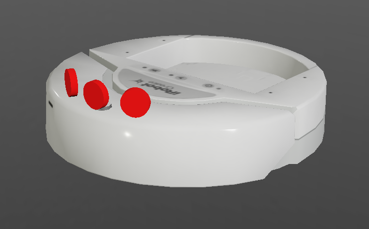
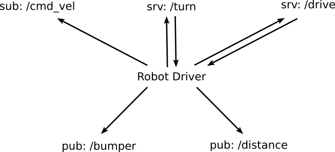
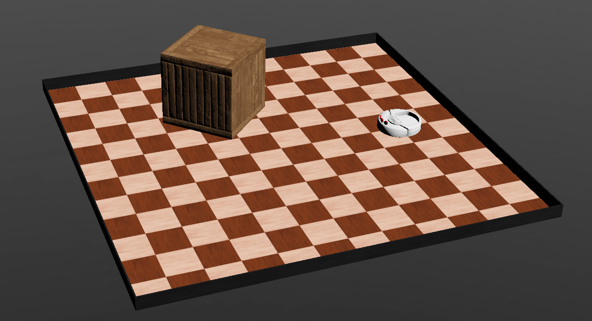
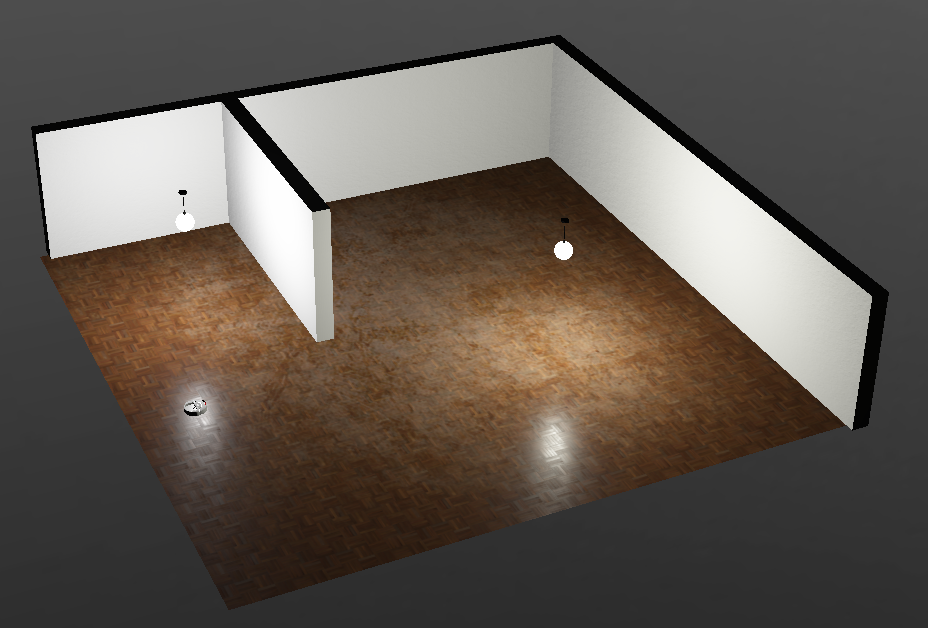
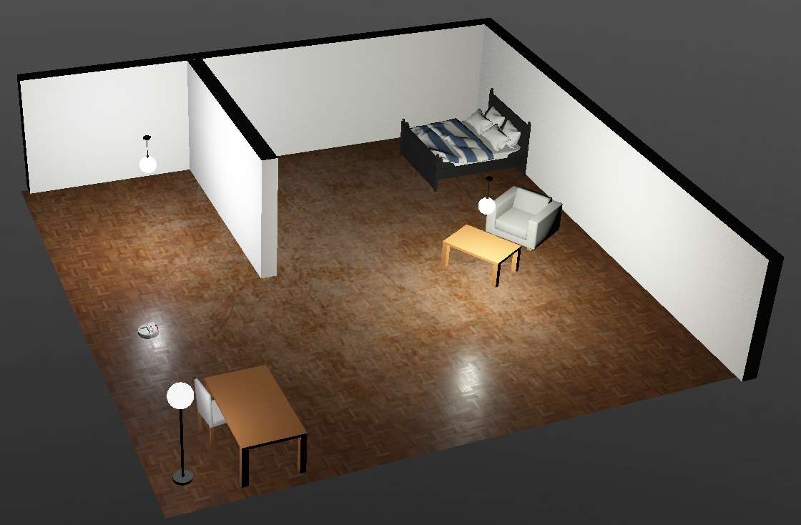

# VacuSim - Robot Programming Training and Competition in a Simulated Vacuum Cleaning Scenario

This project includes a driver for a robot vacuum cleaner as well as a benchmarking tool, which makes it possible to gain first experiences in programming robots using ROS 2 Humble.
The scenario is an apartment that is to be cleaned.
The driver provides interfaces to actuators and sensors of the robot.
The benchmarking tool evaluates the cleaning process.
The focus is on taking the best possible route through the apartment so that the largest possible area is covered and the floor is cleaned as well as possible.




This projects contains the ROS 2 package [`vacusim_robot_driver`](./vacusim_robot_driver/) which depends on the messages and services defined in [`vacusim_robot_interfaces`](./vacusim_robot_interfaces/).

## Status
This project is still in development. All code available on the main branch of this repository is tested with following versions of Webots and ROS 2:


## Setup
Following are the installation steps to get the package running with Webots.

### Installation of the ROS 2 Webots package:
This package contains Webots an specific ROS 2 related dependencies which are needed to create a bridge or a ROS-based controller between ROS 2 and Webots.
```
sudo apt-get install ros-humble-webots-ros2
```
Further information can be found in the [ROS 2 Humble documentation](https://docs.ros.org/en/humble/Tutorials/Advanced/Simulators/Webots/Installation-Ubuntu.html).

### Build the Packages
Clone this repository into your `ros2_ws/src/` directory and build with `colcon`:
```
cd PATH_TO_WS/ros2_ws/src/
git clone https://gitlab.uni-koblenz.de/intas/vacusim.git
cd ..
colcon build --packages-select vacusim_robot_driver vacusim_robot_interfaces
source install/setup.bash
```
To be able to change Pyhton code without rebuilding every package, you may execute `colcon build` with an additional flage `--symlink-install`.

## Quick Start
After properly installing the packages the simulation can by started by launching one the launch files in `vacusim_robot_driver`, e.g.:
```
ros2 launch vacusim_robot_driver simple_arena_launch.py
``` 
Webots will automatically start and open the `simple_arena.wbt` world. The robot driver node will also be running, waiting for commands coming through following topics and services:

```
Topics:
/bumper
/cmd_vel
/distance
```
```
Services:
/drive
/turn
```



## Run a Benchmark
First, launch the robot driver:
```
ros2 launch vacusim_robot_driver robot_driver_launch.py 
```
Now, run your controller node for the robot.

For running a benchmark, start Webots as regular application and open a benchmark world of your choice, e.g. `benchmark_apartment.wbt`.
The benchmark will start immediately.
If the simulation is paused in Webots, the benchmark will also pause.
If the simulation is executed fast forward, the benchmark will also speed up. 

## Overview of The Packages

### `vacusim_robot_interface`
- [`Bumper.msg`](./vacusim_robot_interfaces/msg/Bumper.msg): Message type containing two boolean values for a left and right bumper
- [`Distance.msg`](./vacusim_robot_interfaces/msg/Disntace.msg): Message type containing three float values for a left, middle, and right distance sensor
- [`Drive.srv`](./vacusim_robot_interfaces/srv/Drive.srv): Service type containing a sending float value of distance in meters and a boolean return value when done
- [`Turn.srv`](./vacusim_robot_interfaces/srv/Turn.srv): Service type containing a sending float value of rotation angle in radian and a boolean return value when done

### `vacusim_robot_driver`
This package contains the [`vacusim_robot_driver`](./vacusim_robot_driver/vacusim_robot_driver/vacusim_robot_driver.py) which is the main interface between ROS 2 and Webots. Further, the [`ground`](./vacusim_robot_driver/controllers/ground/) supervisor controller manages the benchmarking of the "cleaning competition".

#### Webots Worlds
- [`simple_arena.wbt`](./vacusim_robot_driver/worlds/simple_arena.wbt): A small and simple arena. There is no benchmarking ground controller in the world.
- [`simple_arena.wbt`](./vacusim_robot_driver/worlds/simple_arena.wbt): A small and simple arena. There is no benchmarking ground controller in the world.
- [`apartment.wbt`](./vacusim_robot_driver/worlds/apartment.wbt): A middle size world with furniture. There is no benchmarking ground controller in the world.
- [`empty_apartment.wbt`](./vacusim_robot_driver/worlds/empty_apartment.wbt): A middle size world without furniture. There is no benchmarking ground controller in the world.

There are two world containing the benchmarking ground controller:
- [`benchmark_apartment.wbt`](./vacusim_robot_driver/worlds/benchmark_apartment.wbt)
- [`benchmark_empty_apartment.wbt`](./vacusim_robot_driver/worlds/empty_apartment.wbt)

#### Launch files
- [`robot_driver_launch.py`](./vacusim_robot_driver/launch/robot_driver_launch.py): Launches only the robot driver node
- [`simple_arena_launch.py`](./vacusim_robot_driver/launch/simple_arena_launch.py): Launches the simple arena world and the robot driver. There is no benchmarking ground controller
- [`apartment_launch.py`](./vacusim_robot_driver/launch/apartment_launch.py): Launches the apartment world and the robot driver. There is no benchmarking ground controller
- [`empty_apartment_launch.py`](./vacusim_robot_driver/launch/apartment_launch.py): Launches the empty apartment world and the robot driver. There is no benchmarking ground controller

Simple Arena             |  Empty Apartment         |  Furnished Apartment 
:-------------------------:|:-------------------------:|:-------------------------:
  |   | 