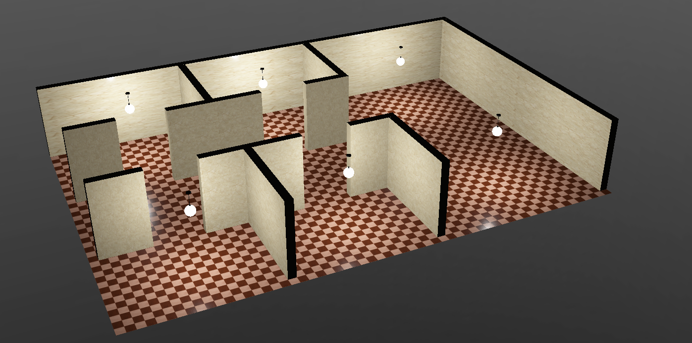
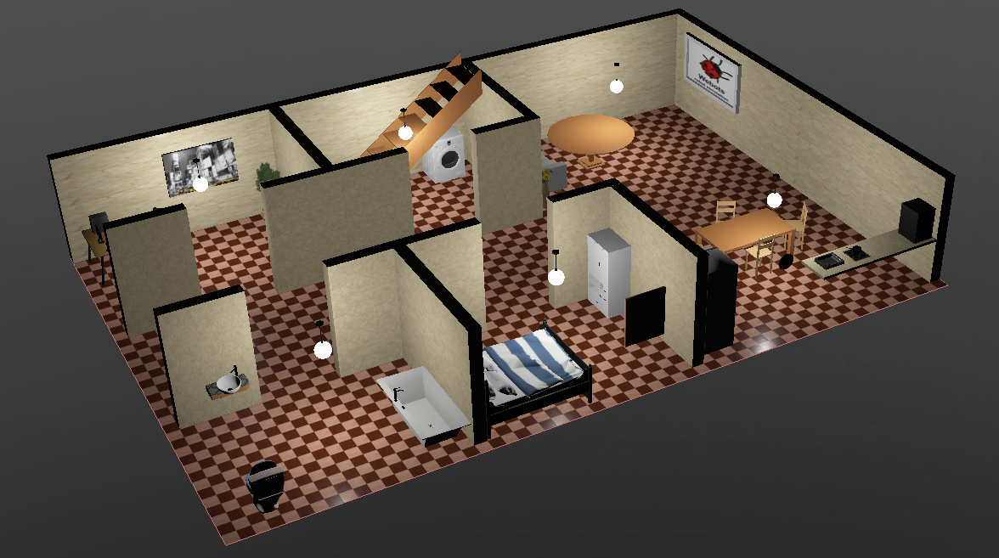

# VacuSim - Robot Programming Training and Competition in a Simulated Vacuum Cleaning Scenario

---

Deutsches Readme: [](README-german.md)

---
This project includes a driver for a robot vacuum cleaner as well as a benchmarking tool, which makes it possible to gain first experiences in programming robots using ROS 2 Humble.
The scenario is an apartment that is to be cleaned.
The driver provides interfaces to actuators and sensors of the robot.
The benchmarking tool evaluates the cleaning process.
The focus is on taking the best possible route through the apartment so that the largest possible area is covered and the floor is cleaned as well as possible.


This projects contains the ROS 2 package [`vacusim_robot_driver`](./vacusim_robot_driver/) which depends on the messages and services defined in [`vacusim_robot_interfaces`](./vacusim_robot_interfaces/).

## Status
This project is still in development. This repository is tested with following versions of Webots and ROS 2:

 

## Setup
Following are the installation steps to get the package running with Webots.

### Installation of the ROS 2 Webots package:
This package contains Webots an specific ROS 2 related dependencies which are needed to create a bridge or a ROS-based controller between ROS 2 and Webots.
```
sudo apt-get install ros-humble-webots-ros2
```
Further information can be found in the [ROS 2 Humble documentation](https://docs.ros.org/en/humble/Tutorials/Advanced/Simulators/Webots/Installation-Ubuntu.html).
Here's the corrected version of the text:

If you now run any Webots-related ROS application, such as `ros2 launch webots_ros2_universal_robot multirobot_launch.py` or the `robot-driver` from this project, a dialogue will appear informing you that you can install Webots directly in the local ROS path `~/.ros/`. With this installation, you'll be able to access ROS-related dependencies like `rclpy` in controller programs in Webots. 

Make sure to add this Webots version to your path by adding the following line to your `~/.bashrc`:

```sh
export PATH="~/.ros/webotsR2023b/webots:$PATH"
```

---

### Build the Packages
Clone this repository into your `ros2_ws/src/` directory and build with `colcon`:
```
cd PATH_TO_WS/ros2_ws/src/
git clone https://gitlab.uni-koblenz.de/intas/vacusim.git
cd ..
colcon build --packages-select vacusim_robot_driver vacusim_robot_interfaces
source install/setup.bash
```
To be able to change Pyhton code without rebuilding every package, you may execute `colcon build` with an additional flage `--symlink-install`.

## Load World

Open the Webots application using the terminal by simply entering `webots`. Ensure that the path is set correctly as described earlier. Select a world file by navigating to `File -> Open World...` and use the explorer to locate the worlds at `vacusim/vacusim_robot_river/worlds`. Select any of the available world files.

After loading a world, you will have access to two topics of the type `Pose2D`:
```sh
/pose/raw   # provides a metric pose with the coordinate system origin in the top left corner of the world.
/pose/tile  # provides a grid pose with tiles of size 0.25x0.25 m and the coordinate system origin in the top left corner of the world.
```
Both topics are useful for navigation tasks. They consists of three fields:
```sh
float64 x       # x coordinate (0 is left)
float64 y       # y coordinate (0 is top)
float64 theta   # agular rotation in radian (0 is oriented to the right)
```

## Launch the Driver
After properly installing the packages the simulation can by started by launching the launch file `robot_driver`:
```
ros2 launch vacusim_robot_driver robot_driver_launch.py 
``` 
The robot driver node will start, waiting for a Webots instance to connect to. Following topics and services are provided:

```
Topics:
/bumper
/cmd_vel
/distance
```
```
Services:
/drive
/turn
```


You can control the robot with the `teleop_twist_keyboard` witch publishes control commands to `/cmd_vel`:

```
 ros2 run teleop_twist_keyboard teleop_twist_keyboard 
```

## Use a Map
There are three types of simple numeric grid map available in [`maps`](./maps):
- [`apartment-40x40.txt`](./maps/apartment-40x40.txt): 40 by 40 tiles grid map of the single room apartment
- [`large-apartment-60x40.txt`](./maps/large-apartment-60x40.txt): 60 by 40 tiles grid map of the large apartment
- [`large-apartment-zones-60x40.txt`](./maps/large-apartment-zones-60x40.txt): 60 by 40 tiles grid map of the large apartment with zones for each room, encoded by numbers from 1 to 7

The script [`example-map-loader.py`](./maps/example-map-loader.py) shows how to load a map into a `numpy` array.

Following are some graphics illustration of the maps:
[`apartment-40x40.txt`](./maps/apartment-40x40.txt)            |  [`large-apartment-60x40.txt`](./maps/large-apartment-60x40.txt)        |  [`large-apartment-zones-60x40.txt`](./maps/large-apartment-zones-60x40.txt)
:-------------------------:|:-------------------------:|:-------------------------:
  |   | 

## Run a Benchmark
First, launch the robot driver:
```
ros2 launch vacusim_robot_driver robot_driver_launch.py 
```
Now, run your controller node for the robot.

For running a benchmark, start Webots as regular application and open a benchmark world of your choice, e.g. `benchmark_apartment.wbt`.
The benchmark will start immediately.
If the simulation is paused in Webots, the benchmark will also pause.
If the simulation is executed fast forward, the benchmark will also speed up. 

## Overview of The Packages

### `vacusim_robot_interface`
- [`Bumper.msg`](./vacusim_robot_interfaces/msg/Bumper.msg): Message type containing two boolean values for a left and right bumper
- [`Distance.msg`](./vacusim_robot_interfaces/msg/Disntace.msg): Message type containing three float values for a left, middle, and right distance sensor
- [`Drive.srv`](./vacusim_robot_interfaces/srv/Drive.srv): Service type containing a sending float value of distance in meters and a boolean return value when done
- [`Turn.srv`](./vacusim_robot_interfaces/srv/Turn.srv): Service type containing a sending float value of rotation angle in radian and a boolean return value when done

### `vacusim_robot_driver`
This package contains the [`vacusim_robot_driver`](./vacusim_robot_driver/vacusim_robot_driver/vacusim_robot_driver.py) which is the main interface between ROS 2 and Webots. Further, the [`ground`](./vacusim_robot_driver/controllers/ground/) supervisor controller manages the benchmarking of the "cleaning competition".

#### Webots Worlds
- [`simple_arena.wbt`](./vacusim_robot_driver/worlds/simple_arena.wbt): A small and simple arena. There is no benchmarking ground controller in the world.
- [`simple_arena.wbt`](./vacusim_robot_driver/worlds/simple_arena.wbt): A small and simple arena. There is no benchmarking ground controller in the world.
- [`apartment.wbt`](./vacusim_robot_driver/worlds/apartment.wbt): A middle size world with furniture. There is no benchmarking ground controller in the world.
- [`empty_apartment.wbt`](./vacusim_robot_driver/worlds/empty_apartment.wbt): A middle size world without furniture. There is no benchmarking ground controller in the world.
- [`large_apartment.wbt`](./vacusim_robot_driver/worlds/large_apartment.wbt): A large size world with furniture. There is no benchmarking ground controller in the world.
- [`empty_large_apartment.wbt.wbt`](./vacusim_robot_driver/worlds/empty_large_apartment.wbt): A middle size world without furniture. There is no benchmarking ground controller in the world.

There are four world containing the benchmarking ground controller:
- [`benchmark_apartment.wbt`](./vacusim_robot_driver/worlds/benchmark_apartment.wbt) (10 minutes benchmark)
- [`benchmark_empty_apartment.wbt`](./vacusim_robot_driver/worlds/benchmark_empty_apartment.wbt) (10 minutes benchmark)
- [`benchmark_large_apartment.wbt`](./vacusim_robot_driver/worlds/benchmark_large_apartment.wbt) (30 minutes benchmark)
- [`benchmark_empty_large_apartment.wbt`](./vacusim_robot_driver/worlds/benchmark_empty_large_apartment.wbt) (30 minutes benchmark)

You can speed up the benchmark time by accelerating the simulation in Webots by clicking on the `fast forward` button. 

#### Launch file
- [`robot_driver_launch.py`](./vacusim_robot_driver/launch/robot_driver_launch.py): Launches only robot driver node


Simple Arena             |  Empty Apartment         |  Furnished Apartment 
:-------------------------:|:-------------------------:|:-------------------------:
  |   | 


Empty Large Apartment           |  Furnished large Apartment          
:-------------------------:|:-------------------------:
  |   